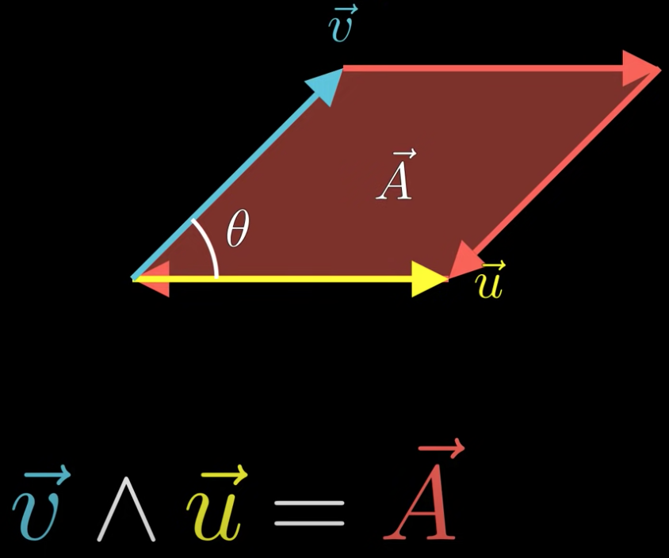

# Space

## 1-dimension subspace

$\vec{a}$ represent this subspace, and this subsapce has direction(same as the direction of $\vec{a}$), and the size of this subspace is $||\vec{a}||$

## 2-dimension subspace

A 2-dimension subspace $\vec{\mathbf{A}}$ can be write as a **bivector** $\vec{u}\wedge\vec{v}$

The orientation of this bivector is the direction of $\vec{u}$, the size of this bivector is the red area.

$\vec{u}\wedge\vec{v} = -\vec{v}\wedge\vec{u}$

$||\vec{u}\wedge\vec{v}|| = ||\vec{u}||||\vec{u}||\sin\theta$

if  $\vec{u}$ and $\vec{v}$ is parallel, $\vec{u}\wedge\vec{v} = 0$(scalar) 

## 3-dimension subspace

A 3-dimension sub space can be write as a **trivector $\vec{u}\wedge\vec{v}\wedge\vec{w}$**

## Orthonormal basis

In k-dimension space, orthonormal basis is  $\{\vec{e_1},\vec{e_e},...,\vec{e_k}\}$,

Any vector $\vec{a} = \sum^k{\alpha_i\vec{e_i}}$